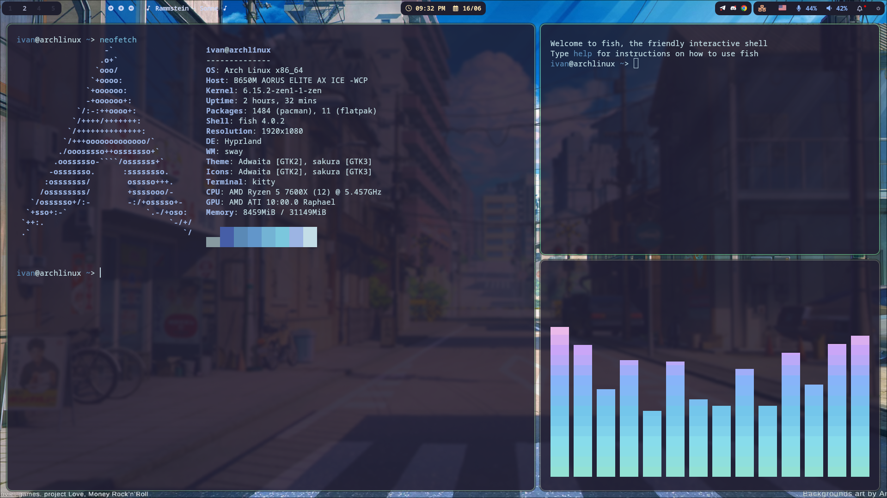
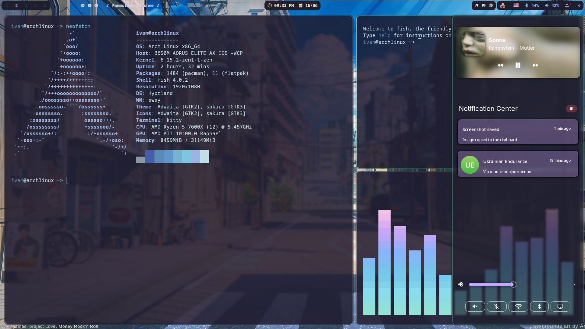
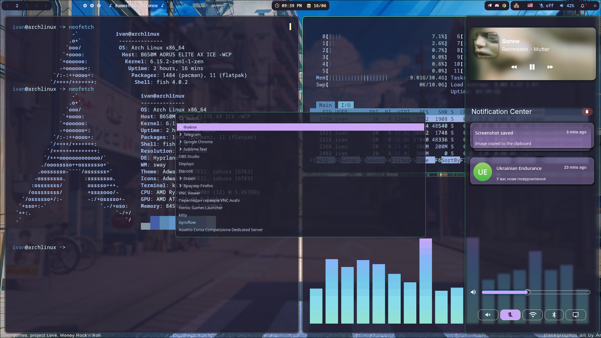

<h1 align="center"> Hyprland Theme </h1>

> ⚠️ **Note:** These dotfiles are tailored specifically for my system. They may not work out-of-the-box for others.

---

## 🔧 Components

<strong>Hyprland</strong>
 
 

- [**Config**](.config/hypr)
- [**Hyprland Github**](https://hyprland.org/)

<strong>Waybar</strong>
 
 

- [**Config**](.config/waybar)
- [**Waybar Github**](https://github.com/Alexays/Waybar)

<strong>Waybar</strong>
 
 

- [**Config**](.config/waybar)
- [**Waybar Github**](https://github.com/Alexays/Waybar)

<strong>Swaync</strong>
 
 

- [**Config**](.config/swaync)
- [**Swaync Github**](https://github.com/ErikReider/SwayNotificationCenter)

<strong>Wofi</strong>
 
 

- [**Config**](.config/wofi)
- [**Wofi Github**](https://github.com/SimplyCEO/wofi)

<strong>Wlogout</strong>
 
 

- [**Config**](.config/wlogout)
- [**Wlogout Github**](https://github.com/ArtsyMacaw/wlogout)

<strong>Wpaperd</strong>
 
 

- [**Config**](.config/wpaperd)
- [**Wallpapers**](.config/wpaperd/Wallpapers)
- [**Wpaperd Github**](https://github.com/danyspin97/wpaperd)

<strong>Kitty</strong>
 
 

- [**Config**](.config/kitty)
- [**Kitty Github**](https://github.com/kovidgoyal/kitty)

 

 

## 🖼️ Gallery

